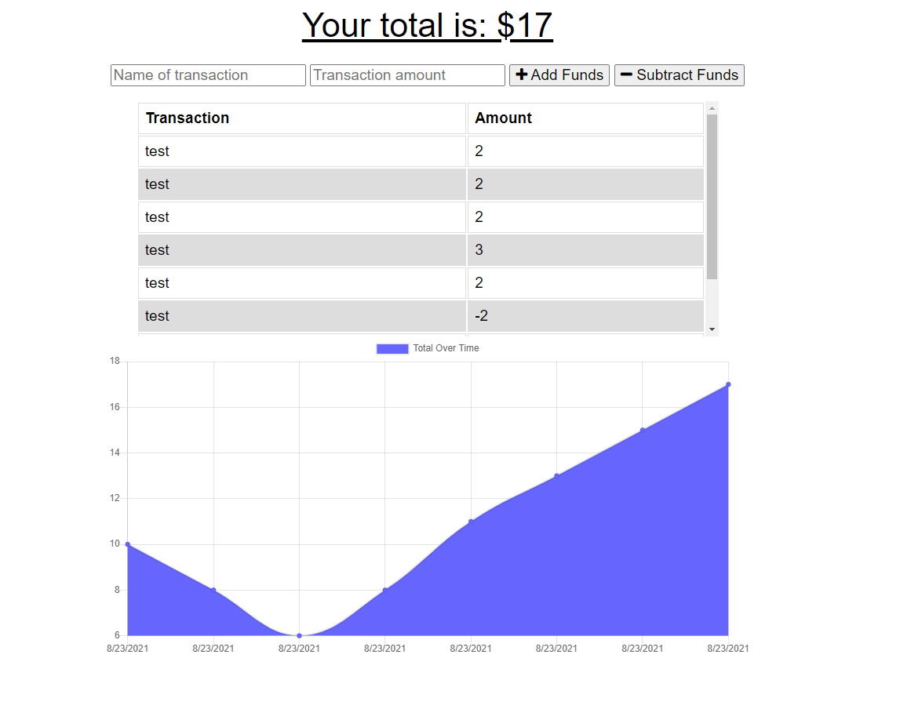

# budget-tracker

## Desciption
budget tracker app

# Table of Contents
[User-Story](#User-Story)
[Architecture](#Architecture)
[User-Story](#User-Story)
[Change-Log](#Change-Log)

## User-Story
AS AN avid traveller I WANT to be able to track my withdrawals and deposits with or without a data/internet connection SO THAT my account balance is accurate when I am traveling

## Architecture
This application is written in JS, HTML and CSS. It uses node and chart libraries

## Images

## Change-Log
8-23-21 5:30pm - Added offline functionality

-->